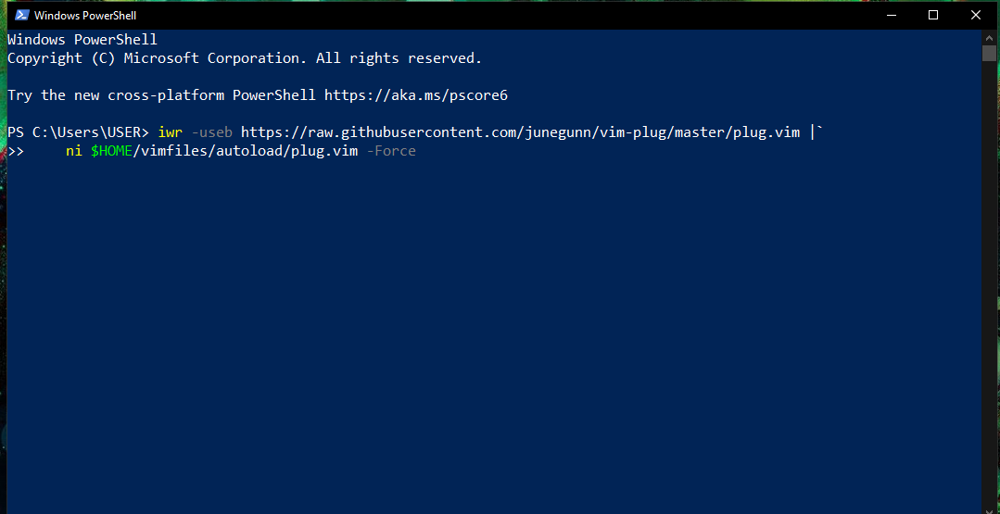

## vim-config-for-windows


#### Langkah awal untuk melakukan vim plug

#### 1. buka terminal windows powershell, lalu copy suber kode dibawah ini:
###### Windows (PowerShell)

```powershell
iwr -useb https://raw.githubusercontent.com/junegunn/vim-plug/master/plug.vim |`
    ni $HOME/vimfiles/autoload/plug.vim -Force
```



