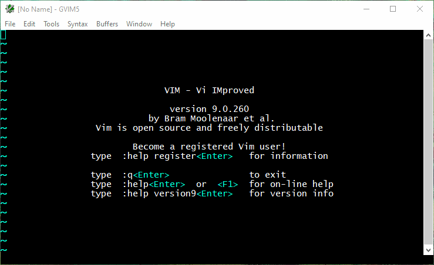

## vim-config-for-windows


#### Langkah awal untuk melakukan vim plug

#### 1. buka terminal windows powershell, lalu copy sumber kode dibawah ini:
###### Windows (PowerShell)

```powershell
iwr -useb https://raw.githubusercontent.com/junegunn/vim-plug/master/plug.vim |`
    ni $HOME/vimfiles/autoload/plug.vim -Force
```

###### untuk lebih lanjut lagi kunjungi github:
```
https://github.com/junegunn/vim-plug/edit/master/README.md
```
#### 2. buat file configurasi vim di path $HOME extensi _vimrc atau _gvimrc
- buka vim ketik :echo $HOME disitulah file configurasi vim berada
- ketik :e _gvimrc atau :e _vimrc


#### 3. salin sumber kode dibawah ini lalu tempelkan ke file _vimrc atau _gvimrc save file tersebut
```
call plug#begin('~/vimfiles/plugged')
" The default plugin directory will be as follows:
"   - Vim (Linux/macOS): '~/.vim/plugged'
"   - Vim (Windows): '~/vimfiles/plugged'
"   - Neovim (Linux/macOS/Windows): stdpath('data') . '/plugged'
" You can specify a custom plugin directory by passing it as the argument
"   - e.g. `call plug#begin('~/.vim/plugged')`
"   - Avoid using standard Vim directory names like 'plugin'

" Make sure you use single quotes

" Shorthand notation; fetches https://github.com/junegunn/vim-easy-align
Plug 'junegunn/vim-easy-align'

" Multiple Plug commands can be written in a single line using | separators
Plug 'SirVer/ultisnips' | Plug 'honza/vim-snippets'

"colorscheme
Plug 'chriskempson/base16-vim'

Plug 'davidhalter/jedi-vim'

" On-demand loading
Plug 'scrooloose/nerdtree', { 'on':  'NERDTreeToggle' }
" Initialize plugin system
" - Automatically executes `filetype plugin indent on` and `syntax enable`.
call plug#end()
" You can revert the settings after the call like so:
"   filetype indent off   " Disable file-type-specific indentation
"   syntax off            " Disable syntax highlighting

" menghilangkan layar split pada docstring 
set completeopt-=preview
filetype plugin indent on

" untuk gui
if has("gui_running")
  set guifont=Lucida_Console:h11
  " untuk menghilangkan toolbar
  set guioptions-=T
endif

" untuk popup text
function! OmniPopup(action)
  if pumvisible()
    if a:action == 'j'
      return "\<C-N>"
    elseif a:action == 'k'
      return "\<C-P>"
    endif
  endif
  return a:action
endfunction
inoremap <silent>j <C-R>=OmniPopup('j')<CR>
inoremap <silent>k <C-R>=OmniPopup('k')<CR>

"tab complete
function! InsertTabWrapper(direction)
  let col = col('.') - 1
  if !col || getline('.')[col - 1] !~ '\k'
    return "\<tab>"
  elseif "backward" == a:direction
    return "\<c-p>"
  else
    return "\<c-n>"
  endif
endfunction
inoremap <tab> <c-r>=InsertTabWrapper ("forward")<cr>
inoremap <s-tab> <c-r>=InsertTabWrapper ("backward")<cr>

inoremap <expr><C-J> pumvisible() ? "\<C-n>" : "\<C-J>"
inoremap <expr><C-K> pumvisible() ? "\<C-p>" : "\<C-K>"
inoremap <expr><Cr>  pumvisible() ? "\<C-y>" : "\<Cr>"


syntax on

let mapleader=","
nmap <leader>so :source $HOME\_vimrc<CR>
set autoindent
set backspace=indent,eol,start
set clipboard=unnamed
set encoding=UTF-8
set expandtab
set fileformat=unix
set filetype=python
set ignorecase
set incsearch
set nocompatible
set noswapfile
set nowrap
set shiftwidth=2
set smartindent
set smarttab
set softtabstop=2
set tabstop=2
set undofile
set visualbell
set ww=<,>,[,]

" jika bekerja dengan file python
autocmd Filetype python setlocal expandtab tabstop=4 shiftwidth=4

```


